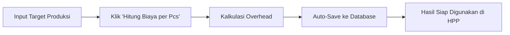

# 🔄 Fitur Auto-Save Biaya Operasional

## Deskripsi
Fitur ini menghilangkan kebutuhan untuk mengklik tombol "Gunakan Angka Ini" di bagian biaya operasional. Sekarang hasil kalkulasi overhead akan otomatis tersimpan dan langsung tersedia untuk perhitungan HPP di resep.

## ✨ Perubahan yang Dilakukan

### 1. 🔄 Auto-Save di `DualModeCalculator.tsx`
- **Sebelum**: User harus klik tombol "Gunakan Angka Ini" setelah kalkulasi
- **Sesudah**: Hasil kalkulasi otomatis tersimpan ke `app_settings` setelah kalkulasi berhasil

### 2. 🚀 Enhanced UX Flow


### 3. 📊 Komponen yang Diupdate
- `DualModeCalculator.tsx`: Modifikasi `handleCalculate()` untuk auto-save
- Tombol manual "Gunakan Angka Ini" dihapus
- Indikator status "✅ Hasil Tersimpan Otomatis" ditambahkan

## 🎯 Benefits

### ✅ User Experience
- **Workflow Lebih Simpel**: Hanya perlu 1 klik untuk hitung dan simpan
- **Mengurangi Kesalahan**: User tidak bisa lupa menyimpan hasil
- **Feedback yang Jelas**: Status auto-save ditampilkan dengan indikator visual

### ⚡ Technical Benefits
- **Real-time Integration**: Overhead langsung tersedia untuk perhitungan HPP
- **Data Consistency**: Hasil selalu tersinkron dengan database
- **Error Handling**: Fallback jika auto-save gagal

## 🔧 Technical Implementation

### Auto-Save Logic
```typescript
// Setelah kalkulasi berhasil
if (calculations.hpp.isValid && calculations.operasional.isValid) {
  try {
    const response = await appSettingsApi.calculateAndUpdateCosts(
      calculations.hpp.totalCosts,
      calculations.operasional.totalCosts,
      targetOutput
    );
    
    if (response.error) {
      toast.warning('Kalkulasi berhasil, tapi gagal menyimpan otomatis');
    } else {
      toast.success('Kalkulasi berhasil dan tersimpan otomatis!');
    }
  } catch (autoSaveError) {
    toast.warning('Kalkulasi berhasil, tapi auto-save gagal');
  }
}
```

### Status Indicator UI
```jsx
<Alert className="border-green-200 bg-green-50">
  <CheckCircle className="h-4 w-4 text-green-600" />
  <AlertDescription>
    <div className="font-medium text-green-800">
      ✅ Hasil Tersimpan Otomatis
    </div>
    <div className="text-xs text-green-600 bg-white p-2 rounded">
      💡 Nilai overhead sudah disimpan ke pengaturan global dan akan 
      digunakan secara otomatis dalam perhitungan HPP resep
    </div>
  </AlertDescription>
</Alert>
```

## 🎨 Visual Changes

### Before (Manual Save):
```
[Hasil Kalkulasi]
[Informasi Penggunaan]
[Tombol: Gunakan Angka Ini] ← User harus klik manual
```

### After (Auto-Save):
```
[Hasil Kalkulasi]
[✅ Status: Hasil Tersimpan Otomatis] ← Feedback otomatis
[Informasi Penggunaan dan Status]
```

## 🔮 Integration dengan HPP

Setelah auto-save, nilai overhead akan:
1. Tersimpan ke tabel `app_settings`
2. Langsung tersedia untuk hook `useEnhancedHppCalculation`
3. Otomatis digunakan dalam kalkulasi HPP resep
4. Konsisten di seluruh aplikasi

## 🚨 Error Handling

- **Auto-save gagal**: Tampilkan warning, tapi kalkulasi tetap bisa digunakan
- **Network error**: Fallback dengan notifikasi yang jelas
- **Data validation**: Validasi sebelum menyimpan

## 📱 User Flow

1. **Input**: User masukkan target produksi
2. **Calculate**: Klik "Hitung Biaya per Pcs"
3. **Auto-Save**: Sistem otomatis simpan hasil
4. **Feedback**: Notifikasi sukses + indikator visual
5. **Integration**: Nilai langsung tersedia di HPP

---

*Fitur ini menggunakan pnpm sesuai dengan preferensi user dan brand color orange untuk konsistensi visual.*
