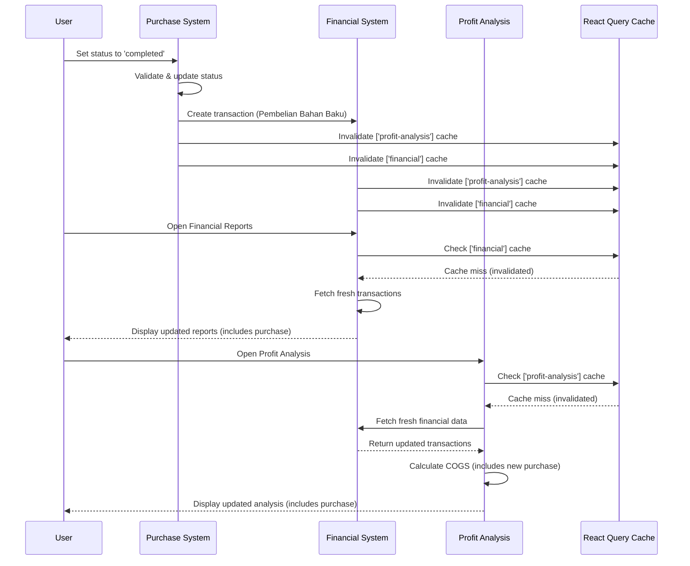

# 🧪 Financial Synchronization Test Guide

## ✅ **Complete Integration Test**

### **Test Flow: Purchase → Financial Reports → Profit Analysis**

This guide helps you verify that purchases, financial reports, and profit analysis are all synchronized correctly.

---

## 🔧 **Test Scenario**

### **Before Starting**
1. **Open Developer Console** (F12)
2. **Clear browser cache** if needed
3. **Note current financial data** for comparison

### **Step 1: Complete a Purchase**
1. Go to `/pembelian` (Purchase page)
2. Create a new purchase or find an existing pending purchase
3. Make sure it has valid items with proper data
4. **Change status to 'completed'**
5. **Watch console logs** for these messages:
   ```
   🔍 Purchase status comparison: {
     previousStatus: "pending",
     newStatus: "completed", 
     willCreateTransaction: true
   }
   💰 Creating financial transaction for completed purchase: {
     purchaseId: "abc123",
     amount: 150000,
     supplier: "Supplier Name"
   }
   📈 Invalidating profit analysis cache after purchase completion
   💰 Invalidating financial transaction cache after purchase completion
   ```

### **Step 2: Verify Financial Reports**
1. Go to `/financial` (Financial Reports page)
2. **Check "Laporan Pengeluaran" section**
3. **Verify**: New expense appears with:
   - Category: "Pembelian Bahan Baku"
   - Amount: Same as purchase total
   - Description: "Pembelian dari [Supplier Name]"
   - Date: Today's date

### **Step 3: Verify Profit Analysis**
1. Go to `/profit-analysis` (Profit Analysis page)
2. **Check "Modal Bahan Baku" section**
3. **Verify**: The purchase amount is included in:
   - Total COGS (Cost of Goods Sold)
   - "🥘 Modal Bahan Baku" card
   - Cost breakdown charts
   - Overall profit calculations

---

## 🎯 **Expected Results**

### **✅ Success Indicators**
- [x] Purchase completion creates financial transaction
- [x] Financial reports show new expense immediately (no refresh needed)
- [x] Profit analysis includes new expense in COGS automatically (no refresh needed)
- [x] Console logs show proper cache invalidation
- [x] All calculations update in real-time

### **❌ Failure Indicators**
If any of these occur, there may be an issue:
- Console errors during purchase completion
- Financial transaction not created (check database)
- Purchase appears in financial reports but not in profit analysis
- Need to manually refresh pages to see updates
- Missing cache invalidation logs

---

## 🔍 **Debug Information**

### **Key Console Logs to Watch For**
1. **Purchase Completion**:
   ```
   ✅ Status mutation onSuccess with: [purchase object]
   🔍 Purchase status comparison: { ... }
   💰 Creating financial transaction for completed purchase: { ... }
   ```

2. **Cache Invalidation**:
   ```
   📈 Invalidating profit analysis cache after purchase completion
   💰 Invalidating financial transaction cache after purchase completion
   📈 Invalidating profit analysis cache after adding financial transaction
   💰 Invalidating all financial caches after adding transaction
   ```

3. **Data Loading**:
   ```
   🔄 Fetching financial transactions
   🔄 Fetching profit analysis for period: [period]
   ✅ Profit analysis completed: { ... }
   ```

### **Database Verification** (Optional)
If you have database access, check:
```sql
-- Check if financial transaction was created
SELECT * FROM financial_transactions 
WHERE category = 'Pembelian Bahan Baku' 
ORDER BY created_at DESC 
LIMIT 5;

-- Check purchase status
SELECT id, status, total_nilai, supplier 
FROM purchases 
WHERE status = 'completed' 
ORDER BY updated_at DESC 
LIMIT 5;
```

---

## 🚀 **Integration Flow Summary**



---

## 🎉 **Success Confirmation**

When everything works correctly, you should see:

1. **Purchase completion** ✅ Creates financial transaction
2. **Financial reports** ✅ Show expense immediately  
3. **Profit analysis** ✅ Includes expense in COGS immediately
4. **Real-time updates** ✅ No manual refresh required
5. **Debug logs** ✅ Show proper cache invalidation flow

**This confirms complete financial system synchronization! 🚀**