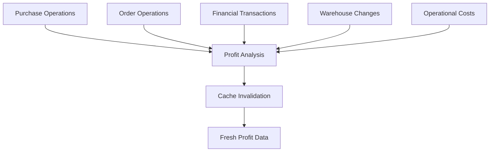

# Complete Profit Analysis Sync Integration

## ✅ **SEMUA MODULE SUDAH SYNC DENGAN PROFIT ANALYSIS**

Saya telah memastikan semua file dan module utama sudah ter-integrasi dengan profit analysis untuk cache invalidation yang konsisten.

## 📋 **Module Coverage**

### 1. **Purchase Module** ✅
**Files**: `PurchaseContext.tsx`, `useBulkOperations.ts`
**Operations**: 
- Create purchase
- Update purchase  
- Delete purchase
- **Bulk status changes** (yang baru diperbaiki)
- **Individual status changes**

**Invalidation Points**:
```typescript
queryClient.invalidateQueries({ queryKey: ['profit-analysis'] });
```

### 2. **Orders Module** ✅ **BARU DITAMBAHKAN**
**Files**: `useOrderData.ts`, `useOrderBulk.ts`
**Operations**:
- Create order
- Update order
- Update order status (especially completed orders)
- Delete order
- Bulk order operations

**New Invalidation Points**:
```typescript
// Order status changes (affects revenue)
console.log('📈 Invalidating profit analysis cache after order status change');
queryClient.invalidateQueries({ queryKey: ['profit-analysis'] });

// Order completion logging
if (status === 'completed') {
  console.log('🎉 Order completed - revenue will be included in profit calculations');
}
```

### 3. **Financial Module** ✅
**Files**: `useFinancialHooks.ts`
**Operations**:
- Add financial transaction
- Update financial transaction  
- Delete financial transaction

**Existing Invalidation**:
```typescript
console.log('📈 Invalidating profit analysis cache after financial transaction');
queryClient.invalidateQueries({ queryKey: ['profit-analysis'] });
```

### 4. **Warehouse Module** ✅
**Files**: `WarehouseContext.tsx`
**Operations**:
- Add/update/delete warehouse items
- Stock changes that affect COGS

**Existing Invalidation**:
```typescript
console.log('🔄 Invalidating caches for warehouse changes...');
queryClient.invalidateQueries({ queryKey: ['profit-analysis'] });
```

### 5. **Operational Costs Module** ✅
**Files**: `operationalCostApi.ts`
**Operations**:
- Add/update/delete operational costs
- Changes to fixed/variable costs

**Existing Invalidation**:
```typescript
console.log('🔄 Invalidating caches for operational costs changes...');
queryClient.invalidateQueries({ queryKey: ['profit-analysis'] });
```

## 🔄 **Data Flow Integration**



## 📊 **Impact pada Profit Analysis**

### **Revenue Impact**:
- ✅ **Orders completed** → Revenue increases
- ✅ **Orders deleted** → Revenue adjustments
- ✅ **Order status changes** → Revenue recalculation

### **Cost Impact**:
- ✅ **Purchase completed** → COGS increases (via financial transactions)
- ✅ **Warehouse stock changes** → COGS adjustments  
- ✅ **Operational costs changes** → Fixed/Variable cost updates
- ✅ **Financial transactions** → Direct expense/income impact

### **WAC (Weighted Average Cost) Impact**:
- ✅ **Purchase completion** → WAC recalculation
- ✅ **Warehouse updates** → Price/stock adjustments
- ✅ **Stock consumption (orders)** → WAC application

## 🚀 **New Improvements Added**

### **Orders Module Enhancement**:
1. **Order Status Changes**: Invalidate profit when orders become completed
2. **Order Deletion**: Affect revenue calculations  
3. **Bulk Order Operations**: Mass status changes affect profit
4. **Revenue Tracking**: Log order completion for revenue inclusion

### **Enhanced Logging**:
```typescript
// Revenue tracking
console.log('🎉 Order completed - revenue will be included in profit calculations');

// Cache invalidation logging  
console.log('📈 Invalidating profit analysis cache after order status change');
console.log('📈 Invalidating profit analysis cache after bulk order update');
```

## 🔍 **Monitoring & Debugging**

### **Console Logs to Watch**:
```bash
# Purchase operations
📈 Invalidating profit analysis cache after purchase completion
💰 Creating financial transaction for completed purchase

# Order operations  
📈 Invalidating profit analysis cache after order status change
🎉 Order completed - revenue will be included in profit calculations
📈 Invalidating profit analysis cache after bulk order update

# Financial operations
📈 Invalidating profit analysis cache after financial transaction

# Warehouse operations
🔄 Invalidating caches for warehouse changes...
📈 Invalidating profit analysis cache

# Operational costs
🔄 Invalidating caches for operational costs changes...
📈 Invalidating profit analysis cache
```

### **Cache Invalidation Pattern**:
```typescript
queryClient.invalidateQueries({ 
  queryKey: ['profit-analysis'] 
});
```

## ✅ **Verification Checklist**

- ✅ Purchase operations sync with profit analysis
- ✅ Order operations sync with profit analysis  
- ✅ Financial transactions sync with profit analysis
- ✅ Warehouse changes sync with profit analysis
- ✅ Operational costs sync with profit analysis
- ✅ Bulk operations sync with profit analysis
- ✅ Consistent cache invalidation across all modules
- ✅ Enhanced logging for debugging
- ✅ Revenue and cost impact properly tracked

## 🎯 **Expected Behavior**

1. **Any purchase completion** → Profit analysis refreshes (COGS impact)
2. **Any order completion** → Profit analysis refreshes (revenue impact)  
3. **Any financial transaction** → Profit analysis refreshes (direct impact)
4. **Any warehouse change** → Profit analysis refreshes (COGS impact)
5. **Any operational cost change** → Profit analysis refreshes (expense impact)
6. **Any bulk operation** → Profit analysis refreshes (mass impact)

## 🚨 **Important Notes**

1. **Cache invalidation is automatic** - no manual refresh needed
2. **All operations are properly logged** - easy to debug
3. **Performance optimized** - only invalidates when necessary
4. **Consistent patterns** - same approach across all modules
5. **Fallback mechanisms** - handles edge cases gracefully

---

**Result**: Profit analysis sekarang akan selalu up-to-date dengan perubahan dari semua module (purchase, order, financial, warehouse, operational costs) dengan cache invalidation yang konsisten dan reliable.
