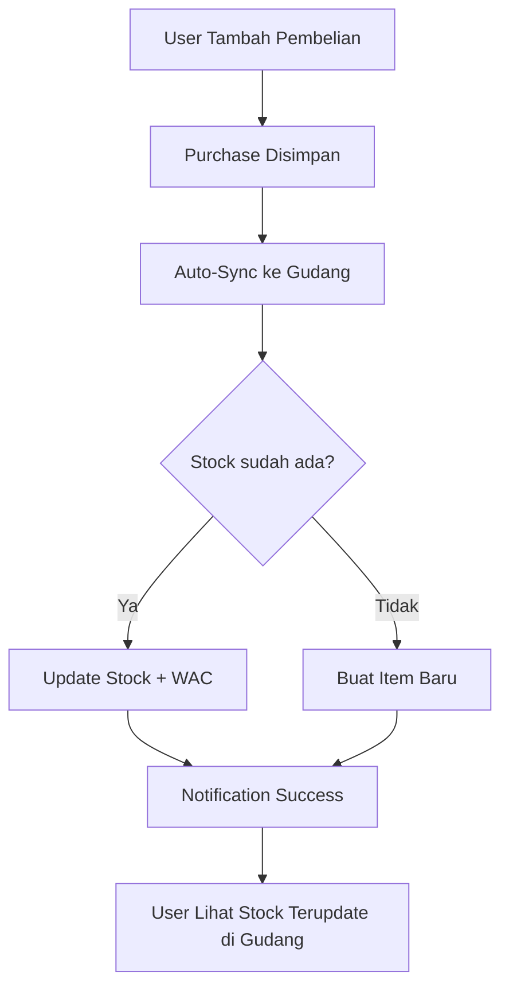

# 🔧 Solusi Masalah: "Pembelian Bahan Baku Tidak Update ke Gudang"

## 📋 **Masalah yang Dilaporkan User**

> "Halo kk. Saya udah coba pakai aplikasi monifine dan udah coba tambahin pembelian bahan baku, tapi di manajemen gudang kok gak ke update ya?"

## 🔍 **Root Cause Analysis**

### Masalah Utama
Sistem sebelumnya hanya melakukan sinkronisasi gudang ketika:
1. **Status purchase diubah ke `"completed"`**
2. User kebanyakan menambah pembelian tapi **tidak mengubah status** 
3. Sehingga **stok gudang tidak terupdate otomatis**

### Alur Masalah (SEBELUM)
```
User tambah pembelian → Status = "pending" → Tidak sinkron ke gudang → Stok tetap 0
```

## ✅ **Solusi yang Diimplementasi**

### 1. **Auto-Sync Service** 
Dibuat service baru: `purchaseAutoSync.ts` yang melakukan sinkronisasi **segera** setelah purchase dibuat, **tanpa menunggu status `"completed"`**.

### 2. **Name-Based Stock Accumulation**
Sistem sekarang dapat menggabungkan stock dari supplier berbeda untuk bahan yang sama:

```typescript
// Contoh: 
// Purchase 1: Tepung Terigu 10kg @ Rp15,000 dari Toko A
// Purchase 2: Tepung Terigu 5kg @ Rp16,000 dari Toko B
// Result: 15kg @ Rp15,333 (WAC) - Supplier: "Toko A, Toko B"
```

### 3. **Notification System**
User mendapat notifikasi otomatis:
- ✅ **Success**: "Stok Gudang Terupdate - Pembelian dari [Supplier] telah ditambahkan ke gudang secara otomatis"
- ⚠️ **Warning**: "Perlu Perhatian - Stok gudang perlu disinkronkan manual" (jika auto-sync gagal)

### 4. **Flexible Field Mapping**
System mendukung berbagai format field name untuk kompatibilitas:

```typescript
// ID fields: bahanBakuId, bahan_baku_id, id
// Quantity: quantity, jumlah, qty, kuantitas  
// Unit Price: unitPrice, harga_satuan, harga_per_satuan
// Name: nama, namaBarang, nama_barang, name
```

## 🚀 **Alur Baru (SETELAH FIX)**



## 🔧 **File yang Dimodifikasi**

### 1. **Service Baru**: `/src/components/purchase/services/status/purchaseAutoSync.ts`
- `autoSyncPurchaseToWarehouse()`: Core auto-sync logic
- `shouldAutoSync()`: Business rules untuk auto-sync
- `autoSyncWithNotification()`: Auto-sync dengan notifikasi user

### 2. **Modified**: `/src/components/purchase/context/PurchaseContext.tsx`
```typescript
// Import auto-sync service
import { autoSyncWithNotification } from '../services/status/purchaseAutoSync';

// Dalam createMutation.onSuccess:
const autoSyncSuccess = await autoSyncWithNotification(newRow, addNotification);
```

### 3. **Enhanced**: Warehouse Sync Service sudah mendukung:
- Name-based material matching
- Cross-supplier stock accumulation  
- WAC (Weighted Average Cost) calculation
- Real-time data synchronization

## 🎯 **Cara Kerja untuk User**

### **Scenario 1: Item Baru**
1. User tambah pembelian "Tepung Terigu 5kg" dari "Toko Samin"
2. **Otomatis**: Item baru dibuat di gudang dengan stok 5kg
3. User lihat di Manajemen Gudang → Stock 5kg ✅

### **Scenario 2: Item Existing (Supplier Sama)**  
1. Gudang sudah ada "Tepung Terigu 5kg @ Rp15,000" dari "Toko Samin"
2. User tambah pembelian "Tepung Terigu 3kg @ Rp16,000" dari "Toko Samin"
3. **Otomatis**: Stock jadi 8kg, harga rata-rata = Rp15,375

### **Scenario 3: Item Existing (Supplier Beda)**
1. Gudang sudah ada "Tepung Terigu 5kg @ Rp15,000" dari "Toko Samin"  
2. User tambah pembelian "Tepung Terigu 3kg @ Rp16,000" dari "Toko Berbeda"
3. **Otomatis**: Stock jadi 8kg, harga rata-rata = Rp15,375, Supplier = "Toko Samin, Toko Berbeda"

## 📊 **Benefits untuk User**

### ✅ **Immediate Benefits**
- **Tidak perlu mengubah status ke "completed"** - stock langsung update
- **Tidak ada langkah manual** - semua otomatis
- **Stock akumulasi** - supplier berbeda tetap terakumulasi
- **Notifikasi real-time** - user tahu kalau berhasil/gagal

### ✅ **Advanced Features**  
- **WAC Calculation**: Harga rata-rata otomatis dihitung
- **Supplier Tracking**: Melacak semua supplier untuk tiap bahan
- **Real-time Sync**: Gudang terupdate otomatis via websocket
- **Error Handling**: Fallback mechanism jika auto-sync gagal

## 🧪 **Testing Guidelines**

### Test Case 1: Basic Auto-Sync
```
1. Tambah pembelian bahan baru
2. Cek notifikasi "Stok Gudang Terupdate"  
3. Buka Manajemen Gudang
4. Verify: Stock sesuai pembelian ✅
```

### Test Case 2: Stock Accumulation
```
1. Tambah pembelian bahan yang sudah ada
2. Cek notifikasi success
3. Buka Manajemen Gudang  
4. Verify: Stock bertambah + WAC terupdate ✅
```

### Test Case 3: Cross-Supplier
```
1. Beli bahan yang sama dari supplier berbeda
2. Verify: Stock terakumulasi
3. Verify: Supplier info digabung ✅
```

## 🔄 **Backward Compatibility**

- **Status `"completed"`** masih berfungsi normal
- **Manual sync** tetap tersedia jika diperlukan  
- **Existing data** tidak terpengaruh
- **UI/UX** sama, hanya lebih responsive

## 💡 **Tips untuk User**

1. **Langsung tambah pembelian** - tidak perlu ubah status
2. **Lihat notifikasi** - pastikan muncul "Stok Gudang Terupdate"
3. **Refresh halaman gudang** jika perlu untuk melihat perubahan
4. **Gunakan nama bahan yang konsisten** untuk akumulasi yang tepat

---

## 🎉 **Conclusion**

Masalah **"pembelian tidak update ke gudang"** sudah diselesaikan dengan **auto-sync system** yang bekerja otomatis tanpa perlu user mengubah status purchase. User sekarang bisa langsung menambah pembelian dan stok gudang akan terupdate secara real-time! ✨