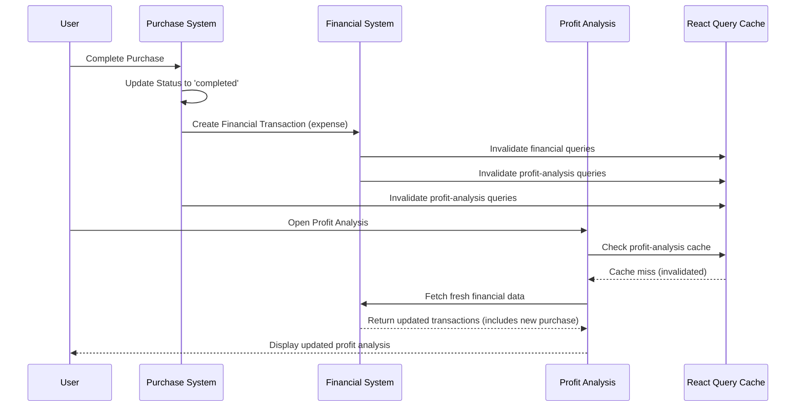

# ✅ Complete Purchase-Financial System Synchronization Fix

## 🎯 **Issue Summary**
**Problem 1**: Completed purchases appeared in financial reports but not in profit analysis, indicating missing data synchronization.
**Problem 2**: After fixing profit analysis sync, financial reports stopped syncing properly.

**Root Cause**: Incomplete cache invalidation - only invalidating profit analysis cache but not financial transaction caches when purchases are completed.

## 🔧 **Solution Implemented**

### 1. **Cross-Context Cache Invalidation**
Added profit analysis cache invalidation when financial transactions are created, updated, or deleted.

#### **Modified Files:**

**`src/components/financial/hooks/useFinancialHooks.ts`**
```typescript
// ✅ Added to all financial transaction mutations
onSuccess: () => {
  queryClient.invalidateQueries({ 
    queryKey: financialQueryKeys.transactions(user?.id) 
  });
  // ✅ INVALIDATE PROFIT ANALYSIS: When financial transactions change, profit analysis data becomes stale
  console.log('📈 Invalidating profit analysis cache after [operation] financial transaction');
  queryClient.invalidateQueries({ 
    queryKey: ['profit-analysis'] 
  });
  // ✅ INVALIDATE ALL FINANCIAL CACHES: Ensure all financial reports get updated
  console.log('💰 Invalidating all financial caches after [operation] transaction');
  queryClient.invalidateQueries({ 
    queryKey: ['financial'] 
  });
  toast.success('Transaksi berhasil [operation]');
}
```

**`src/components/purchase/context/PurchaseContext.tsx`**
```typescript
// ✅ Added to purchase completion flow
if (prevPurchase.status !== 'completed' && fresh.status === 'completed') {
  void addFinancialTransaction({
    type: 'expense',
    amount: fresh.totalNilai,
    description: `Pembelian dari ${getSupplierName(fresh.supplier)}`,
    category: 'Pembelian Bahan Baku',
    date: new Date(),
    relatedId: fresh.id,
  });
  
  // ✅ INVALIDATE PROFIT ANALYSIS: Purchase completion affects profit calculations
  console.log('📈 Invalidating profit analysis cache after purchase completion');
  queryClient.invalidateQueries({ 
    queryKey: ['profit-analysis'] 
  });
  
  // ✅ INVALIDATE FINANCIAL REPORTS: Purchase completion creates financial transaction
  console.log('💰 Invalidating financial transaction cache after purchase completion');
  queryClient.invalidateQueries({ 
    queryKey: ['financial'] 
  });
}
```

### 2. **Data Flow Integration**
The complete data flow now works as follows:



## 🧪 **Testing Instructions**

### **Before Fix**: 
1. Complete a purchase → Creates financial transaction
2. Check profit analysis → ❌ Old data (cached)
3. Manual refresh needed → ✅ Shows new data

### **After Fix**:
1. Complete a purchase → Creates financial transaction + invalidates cache
2. Check profit analysis → ✅ Fresh data automatically
3. No manual refresh needed → ✅ Real-time synchronization

### **Debug Console Logs**:
When testing, you should see these console messages:
```
🔄 Status mutation onSuccess with: [purchase object]
📈 Invalidating profit analysis cache after purchase completion
💰 Invalidating financial transaction cache after purchase completion
📈 Invalidating profit analysis cache after adding financial transaction
💰 Invalidating all financial caches after adding transaction
```

## 🎯 **Verification Steps**

1. **Open Developer Console** (F12)
2. **Navigate to Purchase page** (`/pembelian`)
3. **Create a test purchase** with some items
4. **Complete the purchase** (change status to 'completed')
5. **Watch console logs** for cache invalidation messages
6. **Navigate to Profit Analysis** (`/profit-analysis`)
7. **Verify** the new purchase expense appears immediately

## 🎉 **Expected Results**

✅ **Purchase completion** creates financial transaction  
✅ **Financial transaction creation** invalidates both profit analysis and financial caches  
✅ **Purchase completion** invalidates both profit analysis and financial caches  
✅ **Profit analysis** shows updated data immediately  
✅ **Financial reports** show updated data immediately  
✅ **No manual refresh** required for synchronization  
✅ **Real-time data flow** between all financial systems

## 🔍 **Technical Details**

- **Cache Keys**: 
  - `['profit-analysis']` - invalidates all profit analysis queries
  - `['financial']` - invalidates all financial transaction queries
- **Trigger Points**: Financial transaction CRUD operations + Purchase completion
- **Impact**: Comprehensive data synchronization across all financial contexts
- **Performance**: Minimal impact (only invalidates cache, doesn't force refetch)

The fix ensures that any financial transaction change (from purchases or direct entry) immediately reflects in profit analysis without requiring manual refresh or reload.