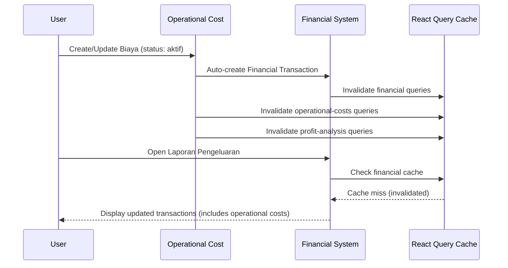

# 🔄 Panduan Sinkronisasi Biaya Operasional dengan Laporan Pengeluaran Financial

## 🎯 **Masalah yang Dipecahkan**

Sebelumnya, biaya operasional tidak otomatis tersinkronisasi dengan laporan pengeluaran di financial. Pengguna harus manual menambahkan transaksi financial untuk setiap biaya operasional yang dibuat.

## 🔧 **Solusi yang Diimplementasikan**

### **Auto-Sync Financial Transactions**

Sekarang sistem akan otomatis:

1. **Membuat transaksi financial** ketika biaya operasional baru ditambahkan dengan status 'aktif'
2. **Memperbarui/menghapus transaksi financial** ketika status biaya operasional diubah
3. **Menghapus transaksi financial** ketika biaya operasional dihapus

### **File yang Dimodifikasi**

**`src/components/operational-costs/services/operationalCostApi.ts`**

#### **1. Import Financial API**
```typescript
import { addFinancialTransaction } from '@/components/financial/services/financialApi';
```

#### **2. Helper Function untuk Auto-Create Transaction**
```typescript
const createFinancialTransactionForCost = async (cost: OperationalCost, userId: string) => {
  try {
    console.log('💰 Creating financial transaction for operational cost:', {
      costId: cost.id,
      nama: cost.nama_biaya,
      amount: cost.jumlah_per_bulan,
      status: cost.status
    });
    
    await addFinancialTransaction({
      type: 'expense',
      amount: cost.jumlah_per_bulan,
      description: `Biaya Operasional: ${cost.nama_biaya}`,
      category: 'Biaya Operasional',
      date: new Date(),
      relatedId: cost.id,
    }, userId);
    
    console.log('✅ Financial transaction created for operational cost');
  } catch (error) {
    logger.error('Error creating financial transaction for operational cost:', error);
    // Don't throw error, just log it so operational cost creation doesn't fail
  }
};
```

#### **3. Auto-Create pada Create Cost**
```typescript
// 💰 Auto-create financial transaction if cost is active
if (typedData.status === 'aktif') {
  await createFinancialTransactionForCost(typedData, userId);
}
```

#### **4. Handle Status Change pada Update Cost**
```typescript
// 💰 Handle financial transaction based on status change
if (typedData.status === 'aktif') {
  // Create or update financial transaction for active cost
  await createFinancialTransactionForCost(typedData, userId);
} else if (typedData.status === 'nonaktif') {
  // Delete related financial transaction if cost becomes inactive
  try {
    const { data: existingTransactions } = await supabase
      .from('financial_transactions')
      .select('id')
      .eq('user_id', userId)
      .eq('related_id', id)
      .eq('type', 'expense');
      
    if (existingTransactions && existingTransactions.length > 0) {
      await supabase
        .from('financial_transactions')
        .delete()
        .eq('user_id', userId)
        .eq('related_id', id)
        .eq('type', 'expense');
      console.log('🗑️ Deleted financial transaction for inactive operational cost');
    }
  } catch (error) {
    logger.error('Error deleting financial transaction for inactive cost:', error);
  }
}
```

#### **5. Auto-Delete pada Delete Cost**
```typescript
// 💰 Delete related financial transactions
try {
  await supabase
    .from('financial_transactions')
    .delete()
    .eq('user_id', userId)
    .eq('related_id', id)
    .eq('type', 'expense');
  console.log('🗑️ Deleted financial transactions for deleted operational cost');
} catch (error) {
  logger.error('Error deleting financial transactions for deleted cost:', error);
}
```

## 🧪 **Cara Testing**

### **Test 1: Create Biaya Operasional Aktif**
1. Buka halaman Biaya Operasional
2. Tambah biaya baru dengan status 'Aktif'
3. Buka halaman Financial → Laporan Pengeluaran
4. **Verifikasi**: Transaksi baru muncul dengan:
   - Kategori: "Biaya Operasional"
   - Deskripsi: "Biaya Operasional: [Nama Biaya]"
   - Jumlah: Sesuai dengan jumlah_per_bulan
   - Tanggal: Hari ini

### **Test 2: Update Status ke Nonaktif**
1. Edit biaya operasional yang sudah ada
2. Ubah status dari 'Aktif' ke 'Nonaktif'
3. Cek laporan pengeluaran financial
4. **Verifikasi**: Transaksi terkait sudah terhapus

### **Test 3: Delete Biaya Operasional**
1. Hapus biaya operasional yang ada
2. Cek laporan pengeluaran financial
3. **Verifikasi**: Transaksi terkait sudah terhapus

### **Test 4: Create Biaya Operasional Nonaktif**
1. Tambah biaya baru dengan status 'Nonaktif'
2. Cek laporan pengeluaran financial
3. **Verifikasi**: Tidak ada transaksi yang dibuat

## 🔍 **Console Logs untuk Debug**

Ketika testing, perhatikan console logs berikut:

```
💰 Creating financial transaction for operational cost: {
  costId: "abc123",
  nama: "Listrik Kantor",
  amount: 500000,
  status: "aktif"
}
✅ Financial transaction created for operational cost
```

```
🗑️ Deleted financial transaction for inactive operational cost
```

```
🗑️ Deleted financial transactions for deleted operational cost
```

## 🎯 **Hasil yang Diharapkan**

✅ **Biaya operasional aktif** otomatis muncul di laporan pengeluaran financial  
✅ **Status change** otomatis update/hapus transaksi financial  
✅ **Delete biaya** otomatis hapus transaksi financial terkait  
✅ **Cache invalidation** memastikan data selalu sinkron  
✅ **Tidak perlu manual** menambah transaksi financial lagi  

## 🔄 **Data Flow**



## 📝 **Catatan Penting**

1. **Kategori Transaksi**: Semua biaya operasional akan muncul dengan kategori "Biaya Operasional"
2. **Related ID**: Setiap transaksi financial memiliki `relatedId` yang menghubungkan ke biaya operasional
3. **Error Handling**: Jika gagal membuat transaksi financial, biaya operasional tetap berhasil dibuat
4. **User Isolation**: Transaksi financial hanya dibuat untuk user yang sama
5. **Real-time Sync**: Perubahan langsung terlihat tanpa perlu refresh manual

Dengan implementasi ini, biaya operasional sekarang sudah fully integrated dengan sistem financial dan profit analysis! 🎉