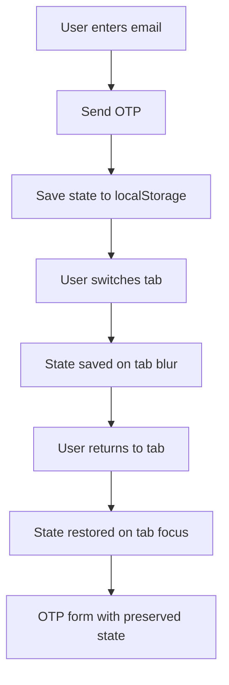

# OTP State Persistence Documentation

## Overview

Fitur OTP State Persistence memungkinkan user untuk pindah tab (misalnya untuk mengecek email) tanpa kehilangan state pada halaman OTP. State akan otomatis tersimpan dan dipulihkan ketika user kembali ke tab autentikasi.

## Problem Statement

### Masalah Sebelumnya
- User input email dan kirim OTP ✅
- User pindah tab untuk cek email ✅  
- User kembali ke tab → **MASALAH**: Kembali ke halaman input email ❌
- User harus input email dan kirim OTP ulang ❌

### Solusi
State OTP disimpan secara persisten menggunakan `localStorage` dan dipulihkan otomatis saat user kembali ke tab.

## Technical Implementation

### Architecture



### Storage Strategy

#### Storage Key
```typescript
const AUTH_STORAGE_KEY = 'otp_auth_state';
```

#### Data Structure
```typescript
interface StoredAuthState {
  email: string;
  authState: 'idle' | 'sending' | 'sent' | 'verifying' | 'error' | 'expired' | 'success';
  cooldownTime: number;
  cooldownStartTime: number;
  otpRequestTime: number;
  timestamp: number;
}
```

### Event Listeners

#### Multiple Browser Compatibility
```typescript
// Primary: Page Visibility API
document.addEventListener('visibilitychange', handleVisibilityChange);

// Fallback: Window Focus/Blur
window.addEventListener('focus', handleWindowFocus);
window.addEventListener('blur', handleWindowBlur);
```

### State Management Flow

#### 1. Saving State
```typescript
const saveAuthState = (data: Partial<StoredAuthState>) => {
  try {
    const existing = JSON.parse(localStorage.getItem(AUTH_STORAGE_KEY) || '{}');
    const updated = { ...existing, ...data, timestamp: Date.now() };
    localStorage.setItem(AUTH_STORAGE_KEY, JSON.stringify(updated));
  } catch (error) {
    // Handle gracefully
  }
};
```

#### 2. Loading State
```typescript
const loadAuthState = () => {
  try {
    const stored = localStorage.getItem(AUTH_STORAGE_KEY);
    if (!stored) return null;
    
    const data = JSON.parse(stored);
    
    // Expire after 10 minutes
    const age = Date.now() - (data.timestamp || 0);
    if (age > 10 * 60 * 1000) {
      localStorage.removeItem(AUTH_STORAGE_KEY);
      return null;
    }
    
    return data;
  } catch (error) {
    return null;
  }
};
```

#### 3. State Restoration
```typescript
useEffect(() => {
  const stored = loadAuthState();
  if (stored && stored.authState === 'sent') {
    // Restore OTP form state
    setAuthState('sent');
    setEmail(stored.email);
    
    // Restore cooldown timer
    if (stored.cooldownStartTime && stored.cooldownTime) {
      const elapsed = Math.floor((Date.now() - stored.cooldownStartTime) / 1000);
      const remaining = Math.max(0, stored.cooldownTime - elapsed);
      if (remaining > 0) {
        setCooldownTime(remaining);
        startCooldownTimer();
      }
    }
  }
}, []);
```

## Features

### ✅ Universal Device Support
- **Desktop**: Full support untuk tab switching
- **Mobile**: Support untuk app switching
- **Tablet**: Hybrid support

### ✅ Smart Cooldown Management
- Timer countdown tersimpan dan dipulihkan
- Elapsed time calculation otomatis
- Tidak perlu kirim OTP ulang jika masih dalam cooldown

### ✅ Browser Compatibility
- **Chrome/Edge**: `visibilitychange` + `focus/blur`
- **Firefox**: `visibilitychange` + `focus/blur`
- **Safari**: `focus/blur` fallback
- **Mobile browsers**: `visibilitychange` + app lifecycle

### ✅ Data Expiration
- State otomatis expire setelah **10 menit**
- Automatic cleanup untuk prevent storage bloat
- Fresh state untuk session baru

### ✅ Error Handling
- Graceful degradation jika localStorage tidak available
- Try-catch untuk semua storage operations
- Fallback ke normal behavior jika persistence fail

## User Experience

### Before Fix
```
1. User: Input email ✅
2. User: Send OTP ✅
3. User: Switch tab to check email ✅
4. User: Return to tab ❌ → Back to email input
5. User: Re-enter email and resend OTP ❌
```

### After Fix
```
1. User: Input email ✅
2. User: Send OTP ✅
3. User: Switch tab to check email ✅
4. User: Return to tab ✅ → Still on OTP form
5. User: Enter OTP and login ✅
```

### User Feedback
- Toast notification: `"Status login dipulihkan. Silakan masukkan kode OTP (X menit tersisa)."`
- Toast deduplication untuk prevent spam
- Timing information untuk OTP validity

## Code Examples

### Basic Usage
```typescript
// Send OTP
const handleSendOtp = async () => {
  const success = await sendEmailOtp(email);
  
  if (success) {
    setAuthState('sent');
    // State automatically saved here
    saveAuthState({
      email,
      authState: 'sent',
      cooldownTime: 60,
      cooldownStartTime: Date.now(),
      otpRequestTime: Date.now()
    });
  }
};

// Tab switching automatically handled
// No additional code needed!
```

### Advanced State Restoration
```typescript
const restoreAuthState = () => {
  const stored = loadAuthState();
  if (!stored) return;
  
  // Restore form state
  setEmail(stored.email);
  setAuthState(stored.authState);
  
  // Restore cooldown with elapsed calculation
  if (stored.cooldownStartTime) {
    const elapsed = Math.floor((Date.now() - stored.cooldownStartTime) / 1000);
    const remaining = Math.max(0, stored.cooldownTime - elapsed);
    setCooldownTime(remaining);
  }
  
  // Show restoration feedback
  toast.info("Status login dipulihkan");
};
```

## Testing Scenarios

### ✅ Desktop Testing
1. Open browser → Navigate to `/auth`
2. Enter email → Send OTP
3. Open new tab → Check email
4. Return to auth tab → **Verify**: Still on OTP form
5. Enter OTP → **Verify**: Login successful

### ✅ Mobile Testing
1. Open mobile browser → Navigate to `/auth`
2. Enter email → Send OTP  
3. Switch to email app
4. Return to browser → **Verify**: Still on OTP form
5. Enter OTP → **Verify**: Login successful

### ✅ Edge Cases
- **Long delay**: State should expire after 10 minutes
- **Multiple tabs**: Each tab maintains independent state
- **Browser refresh**: State should persist across refreshes
- **Storage disabled**: Should fallback gracefully
- **Network issues**: State preserved during connectivity problems

## Monitoring & Debugging

### Console Logs
```typescript
// State saving
logger.debug('💾 Auth state saved:', data);

// State loading  
logger.debug('💾 Auth state loaded:', data);

// State restoration
logger.debug('💾 Tab became visible, restoring OTP state');
```

### Storage Inspection
```javascript
// Check current state in browser console
JSON.parse(localStorage.getItem('otp_auth_state'));

// Clear state manually (for testing)
localStorage.removeItem('otp_auth_state');
```

### Debug Commands
```javascript
// View all localStorage keys
Object.keys(localStorage).filter(key => key.includes('otp'));

// Check state age
const state = JSON.parse(localStorage.getItem('otp_auth_state'));
const age = Date.now() - state.timestamp;
console.log(`State age: ${age}ms`);
```

## Performance Considerations

### Storage Size
- **Per session**: ~200-500 bytes
- **Automatic cleanup**: 10-minute expiration
- **Memory impact**: Minimal (localStorage is persistent)

### Event Frequency
- **visibilitychange**: Only on tab switch (~1-2 times per OTP session)
- **focus/blur**: Only on window focus change
- **No polling**: Event-driven architecture only

### Browser Performance
- **No timers**: Except for cooldown UI updates
- **Lazy loading**: State only loaded when needed
- **Efficient cleanup**: Automatic garbage collection

## Future Enhancements

### Potential Improvements
- [ ] **Multi-device sync**: Sync OTP state across devices
- [ ] **Encrypted storage**: Encrypt sensitive state data  
- [ ] **Progressive enhancement**: Better mobile app integration
- [ ] **Analytics**: Track restoration success rates
- [ ] **A/B testing**: Compare with/without persistence

### Configuration Options
- [ ] **Configurable expiration**: Allow custom timeout
- [ ] **Storage backend**: Support sessionStorage option
- [ ] **Disable option**: Feature flag untuk disable persistence

## Troubleshooting

### Common Issues

#### State Not Persisting
**Symptoms**: User returns to email input after tab switch
**Solutions**:
1. Check browser localStorage support
2. Verify no browser extensions blocking storage
3. Check console for storage errors
4. Test in incognito mode

#### Toast Spam  
**Symptoms**: Multiple "Status dipulihkan" notifications
**Solutions**:
1. Clear sessionStorage: `sessionStorage.removeItem('auth_restored_info')`
2. Check for multiple event listeners
3. Verify toast deduplication logic

#### Cooldown Issues
**Symptoms**: Timer not restored correctly
**Solutions**:
1. Check `cooldownStartTime` in localStorage
2. Verify elapsed time calculation
3. Test timer restoration logic

### Debug Checklist
- [ ] localStorage available and writable
- [ ] State data structure correct
- [ ] Event listeners attached properly  
- [ ] Toast deduplication working
- [ ] Cooldown calculation accurate
- [ ] Expiration logic functional

## Changelog

### v1.0.0 (Current)
- ✅ Universal device support (desktop + mobile)
- ✅ Multi-browser compatibility
- ✅ Smart cooldown restoration
- ✅ Toast deduplication
- ✅ 10-minute expiration
- ✅ Comprehensive error handling

### Previous Issues (Fixed)
- ❌ Mobile-only restriction removed
- ❌ visibilitychange browser support improved
- ❌ State restoration reliability enhanced
- ❌ Toast spam prevented

---

**File**: `src/components/EmailAuthPage.tsx`  
**Last Updated**: 2025-01-19  
**Maintainer**: Development Team