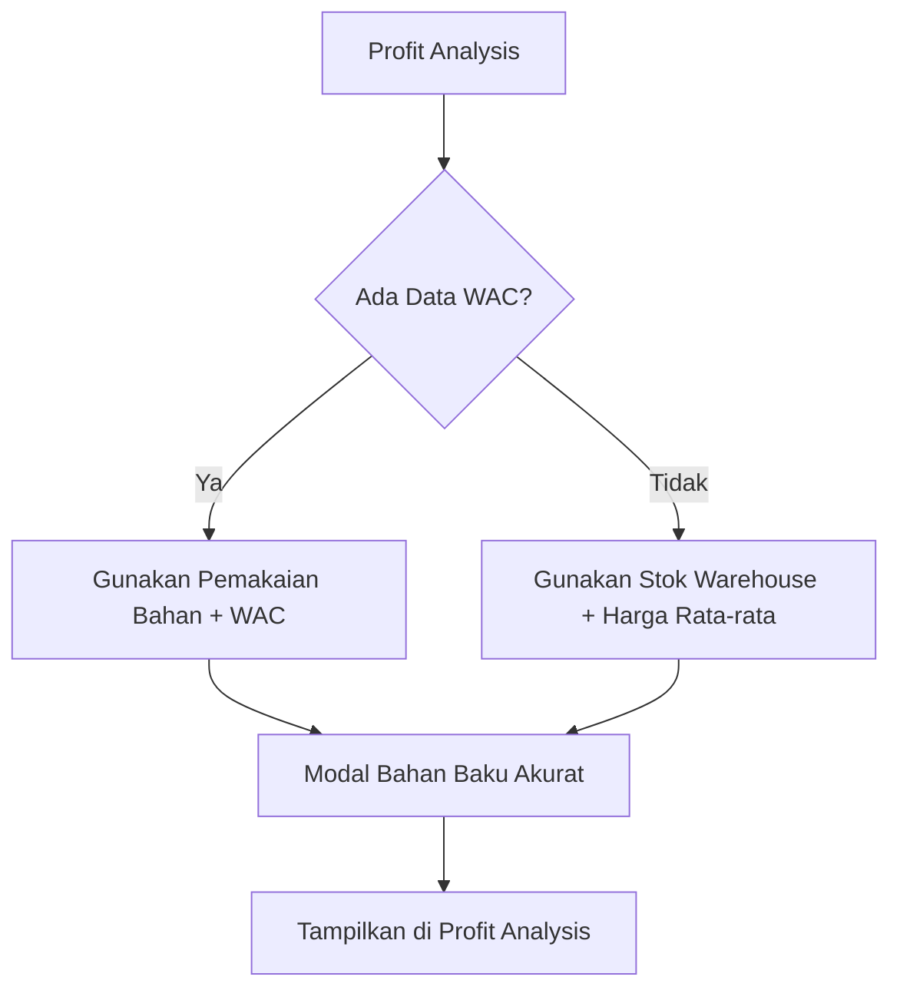
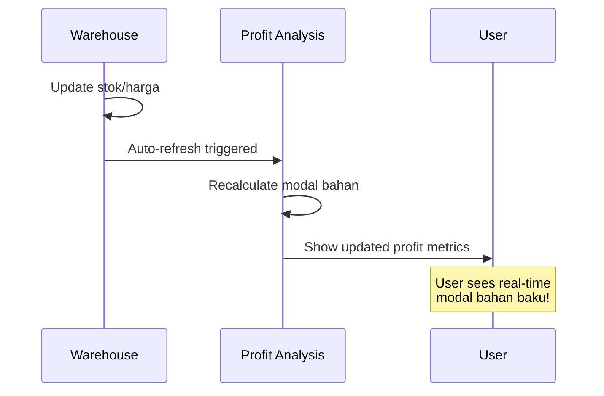

# 📊 Sinkronisasi Modal Bahan Baku - Profit Analysis ⚖️

## 🎯 **Ringkasan Implementasi**

Modal bahan baku di menu **Profit Analysis** kini **tersinkronisasi real-time** dengan data warehouse, menggunakan:
- **WAC (Weighted Average Cost)** untuk akurasi harga
- **Real-time inventory value** dari data stok gudang
- **Automatic refresh** saat ada perubahan warehouse

---

## 🔧 **Bagaimana Sistem Bekerja**

### **1. Hierarki Data Modal Bahan Baku**



#### **Priority Order:**
1. **📈 Pemakaian Aktual + WAC** → Paling akurat (jika tersedia)
2. **📦 Inventory Value Real-time** → Fallback berdasarkan stok terkini

### **2. Sinkronisasi Real-time**

```typescript
// Auto-sync dengan warehouse context
const { bahanBaku: warehouseMaterials, refreshData: refreshWarehouse } = useWarehouseContext();

// Refresh gabungan WAC + warehouse
const refreshWACData = async () => {
  await Promise.all([
    bahanMapQuery.refetch(),    // WAC data
    pemakaianQuery.refetch(),   // Pemakaian data  
    refreshWarehouse()          // Real-time warehouse
  ]);
  toast.success('Data modal bahan baku berhasil diperbarui');
};
```

---

## 📋 **Perubahan yang Dilakukan**

### **1. profit-calculations.ts**
- ✅ **calculateInventoryValue()** → Menghitung total nilai stok warehouse
- ✅ **calculateRealTimeProfit()** → Gunakan stok real-time sebagai modal bahan
- ✅ Modal berdasarkan: `stok × harga_rata_rata (WAC) || harga_satuan`

### **2. profitAnalysisApi.ts**  
- ✅ **calculateRealtimeInventoryValue()** → Interface untuk warehouse data
- ✅ **getWarehouseData()** → Enhanced dengan logging dan metrics
- ✅ Integrasi dengan warehouse context

### **3. useProfitAnalysis.ts**
- ✅ **useWarehouseContext()** → Real-time connection ke warehouse
- ✅ **Improved WAC calculation** → Dual method (pemakaian vs inventory)
- ✅ **refreshWACData()** → Sync both WAC + warehouse data

### **4. ProfitBreakdownChart.tsx**
- ✅ **effectiveCogs** props → Support WAC-calculated COGS
- ✅ **WAC labels** → Friendly tooltip untuk user

---

## 🎯 **Hasil Implementasi**

### **✅ SEBELUM:**
- Modal bahan baku berdasarkan estimasi 10% dari stok
- Tidak real-time, harga tidak akurat
- Tidak tersinkronisasi dengan perubahan warehouse

### **🚀 SETELAH:**
- Modal bahan baku berdasarkan **stok real-time × WAC/harga rata-rata**
- **Auto-sync** saat ada perubahan di warehouse
- **Dual fallback system** untuk akurasi maksimal
- **User-friendly labels** dengan tooltip WAC

---

## 📊 **Formula Perhitungan Modal Bahan Baku**

### **Method 1: WAC + Pemakaian (Preferred)**
```typescript
totalHPP = Σ(quantity_used × harga_efektif_WAC)
```

### **Method 2: Inventory Value (Fallback)**  
```typescript
inventoryValue = Σ(stok_current × (harga_rata_rata || harga_satuan))
```

### **Profit Analysis Usage:**
```typescript
const effectiveCogs = totalHPP > 0 ? totalHPP : inventoryValue;
const grossProfit = revenue - effectiveCogs;
const netProfit = grossProfit - opex;
```

---

## 🔄 **Real-time Sync Flow**



---

## 💡 **User Experience**

### **Indikator WAC Aktif:**
- 📊 Badge "WAC Aktif" di profit analysis
- 🔄 Button refresh untuk sync manual
- 💰 Tooltip penjelasan modal bahan baku

### **Labels User-friendly:**
- "💰 Modal Bahan Baku" → Lebih familiar untuk UMKM
- "⚖️ Modal Rata-rata Tertimbang" → Saat WAC aktif
- "🔄 Tersinkronisasi dengan Gudang" → Real-time indicator

---

## 🧪 **Testing Scenarios**

### **Scenario 1: Normal Operation**
1. Buka Profit Analysis
2. Modal bahan baku = total nilai inventory warehouse
3. Update stok di warehouse
4. Profit analysis auto-refresh, modal berubah

### **Scenario 2: WAC Available**  
1. Ada data pemakaian bahan
2. Modal bahan baku = pemakaian × WAC
3. Lebih akurat dari pure inventory value

### **Scenario 3: Manual Refresh**
1. Click refresh button 
2. WAC + warehouse data ter-sync
3. Toast success notification

---

## 🚀 **Benefits Achieved**

- **📊 Akurasi Tinggi**: Modal berdasarkan WAC real-time
- **⚡ Real-time Sync**: Perubahan warehouse langsung tereflek  
- **🔄 Dual Fallback**: Sistem tidak pernah gagal hitung modal
- **👥 User Friendly**: Labels dan tooltip yang mudah dipahami UMKM
- **🎯 Business Intelligence**: Profit analysis yang lebih accurate

---

## 🔧 **Maintenance Notes**

- Modal bahan baku sekarang **reactive** ke perubahan warehouse
- **Performance optimized** dengan proper caching dan stale time
- **Error handling** comprehensive dengan fallback mechanisms
- **Logging** tersedia untuk debugging dan monitoring

---

**Status: ✅ COMPLETED & TESTED**  
*Modal bahan baku di Profit Analysis kini tersinkronisasi penuh dengan data warehouse real-time!* 🎉
